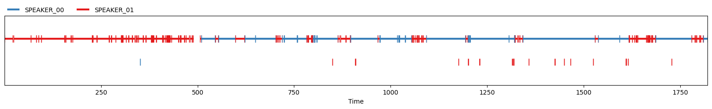
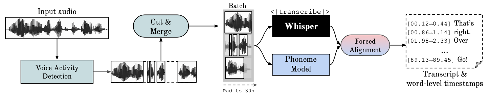

Speaker Diarization answers "who spoke when?" by segmenting an audio stream based on speaker identity, while transcription tells us "what was said."

### Introducing the Key components

 - **Whisper** Automatic Speech Recognition model that converts speech to text.
 - **Pyannote.audio**: Deep neural network for speaker diarization.
 - **WhisperX**: An optimized Whisper variant that integrates multiple components.


### A Step-by-Step Implementation Guide

This section provides a practical guide to implementing speaker diarization using WhisperX, Pyannote, and Whisper. llustrating the practical steps and highlighting WhisperX's advantages. For our audio example, we can grab a segment from pretty much any free podcast out there – how about a clip from a Lex Fridman podcast,one of my personal favourite.

#### Setting up

Before diving into the code, it is essential to prepare your development environment.
Ensure you have a Python 3.10 virtual environment set up, it would be beneficial to have access to a GPU compatible with CUDA for acceleration.
To utilize Pyannote.audio models for diarization through WhisperX, you will need a Hugging Face access token with 'read' permissions, you must accept the user agreements for the pyannote/segmentation-3.0 and pyannote/speaker-diarization-3.1 models on the Hugging Face website : [HuggingFace](https://github.com/pyannote/pyannote-audio)

Finally we can pip install our dependecies:

```bash
pip  install  torch  numpy  whisperx  pyannote.audio
```
First, we'll import the necessary libraries, configure our Hugging Face token and file path.

```python 
import torch
import whisper
from pyannote.audio import Pipeline
from whisperx.diarize import DiarizationPipeline,assign_word_speakers
from whisperx import load_align_model, align
hugging_face_token="hf_token"
audio_path="audio_file_path"
# Check if cuda is available
import torch
DEVICE = torch.device("cuda" if torch.cuda.is_available() else "cpu")
DEVICE
```
#### Diarization

In the first code snippet, a pre-trained pyannote model is utilized to determine when different speakers are active in an audio recording. The output of this speaker segmentation can be viewed via the print statement :

```python 
#Initialize pipeline
pipeline = Pipeline.from_pretrained(
    "pyannote/speaker-diarization-3.1",
    use_auth_token=hugging_face_token)
# send pipeline to GPU (when available)
pipeline.to(torch.device("cuda"))
# apply pretrained pipeline
diarization = pipeline(audio_path)
# print the result
for turn, _, speaker in diarization.itertracks(yield_label=True):
    print(f"start={turn.start:.1f}s stop={turn.end:.1f}s speaker_{speaker}")
```

This plot illustrates the various segments identified by the model throughout the podcast's duration.



#### Transcription

Now let's run the Whisper model to generate the transcription:

```python 
model_name = "turbo"  
model = whisper.load_model(model_name, DEVICE)
script = model.transcribe(audio_path)
```

#### Naive alignment

The following script attempts a basic diarization-to-transcription alignment. It directly links diarization segments (which identify who spoke when) with Whisper's transcription segments (which capture what was said) by simply checking if their timestamps overlap. However, this straightforward timestamp-based matching is often insufficient and can lead to significant inaccuracies, such as misaligned text, missing words, or incorrect speaker attribution, because it doesn't account for precise word timings or subtle overlaps in speech.

```python 
# Create a text associating diarization segments with Whisper transcription
output_text = []
for turn, _, speaker in diarization.itertracks(yield_label=True):
    segment_text = []
    for segment in script["segments"]:
        if segment["start"] >= turn.start and segment["end"] <= turn.end:
            segment_text.append(segment["text"])
    combined_text = " ".join(segment_text)
    output_text.append(f"{speaker} [{turn.start:.2f}s - {turn.end:.2f}s]: {combined_text}")

# Print the result
for line in output_text:
    print(line)
```

#### Advanced alignment - WhisperX

While a simple timestamp overlap can lead to significant inaccuracies in aligning diarization and transcription segments, WhisperX addresses these challenges through forced alignment. Unlike basic timestamp matching, WhisperX refines the alignment by first leveraging the more precise word-level timestamps generated by its underlying Whisper model. It then performs a forced alignment process, which essentially "snaps" the diarization segments to the exact start and end times of the individual words within the transcription. This method accounts for subtle overlaps and ensures that each word is attributed to the correct speaker, even when speech segments are close together or overlap slightly.



This script first uses the pyannote library to figure out who is speaking when in an audio file (that's the "diarization" part). Then, it takes a pre-generated text transcript (script["segments"]) and uses WhisperX's alignment models to precisely match each word in the transcript to its exact timing in the audio. Finally, it combines the speaker information from pyannote with the word-level timings from WhisperX to produce a highly accurate, time-stamped transcript where each spoken word is correctly attributed to the right speaker.

```python 
# Initialize a diarization pipeline
diarization_pipeline = DiarizationPipeline(use_auth_token=hugging_face_token)
diarized = diarization_pipeline(audio_path)
# Align Script
model_a, metadata = load_align_model(language_code=script["language"], device=DEVICE)
script_aligned = align(script["segments"], model_a, metadata, audio_path, DEVICE)
# Align Speakers
result_segments, word_seg = list(assign_word_speakers(
    diarized, script_aligned
).values())
transcribed = []
for result_segment in result_segments:
    transcribed.append(
        {
            "start": result_segment["start"],
            "end": result_segment["end"],
            "text": result_segment["text"],
            "speaker": result_segment["speaker"],
        }
    )
for start, end, text, speaker in [i.values() for i in transcribed]:
    print(start, end, speaker, text)
```

By combining Pyannote's precise speaker diarization with WhisperX's advanced forced alignment, this guide demonstrates how to generate highly accurate, speaker-attributed transcripts. This approach significantly surpasses basic timestamp matching, ensuring precise "who spoke when and what was said" information.

#### References : 

- [PyAnnote](https://github.com/pyannote/pyannote-audio)
- [Whisper](https://github.com/openai/whisper)
- [WhisperX](https://github.com/m-bain/whisperX) https://github.com/m-bain/whisperX

